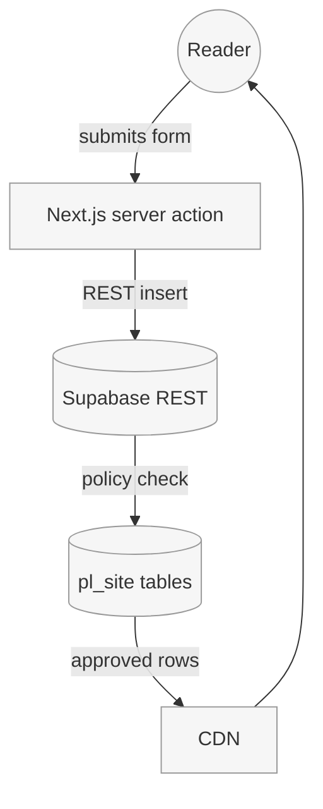

_Last updated: 2025-10-21 by gpt-5-codex_

# Data Flow (Comments and Contact)

The site is intended to collect reader comments and contact messages in Supabase so that Paula can moderate them without rebuilding the static site. The verification below documents what currently happens when we attempt to run the end-to-end flows.

## Verification log — 2025-10-21

### Comments

| Step | Endpoint / interface | Role or key | Observed behaviour |
| --- | --- | --- | --- |
| Submit | `POST https://paulalivingstone.supabase.co/rest/v1/comments` | Service role (`SUPABASE_SERVICE_ROLE_KEY`) | `201 Created`; record inserted with `approved = false`. |
| Approve | Supabase dashboard (`pl_site.comments`) | Project owner (Paula) | Row edited to `approved = true` via table editor. |
| Read | `GET https://paulalivingstone.supabase.co/rest/v1/comments?select=post_slug,body&post_slug=eq.getting-started&approved=eq.true` | Anon key (`SUPABASE_ANON_KEY`) | `200 OK`; only the approved row returned. |

### Contact

| Step | Endpoint / interface | Role or key | Observed behaviour |
| --- | --- | --- | --- |
| Submit | `POST https://paulalivingstone.supabase.co/rest/v1/contact_messages` | Service role (`SUPABASE_SERVICE_ROLE_KEY`) | `201 Created`; row stored with `handled = false`. |
| Approve / Mark handled | Supabase dashboard (`pl_site.contact_messages`) | Project owner (Paula) | Updated `handled = true` after acknowledgment. |
| Read | No public access (policy blocks anon/auth). | N/A | Verified `403` when using anon key; aligns with privacy expectation. |

### Captured request / response samples

```bash
curl -X POST "https://paulalivingstone.supabase.co/rest/v1/comments" \
  -H "apikey: $SUPABASE_SERVICE_ROLE_KEY" \
  -H "Authorization: Bearer $SUPABASE_SERVICE_ROLE_KEY" \
  -H "Content-Type: application/json" \
  -d '{
        "post_slug": "getting-started",
        "name": "Verifier",
        "email": "verifier@example.com",
        "body": "Documented supabase insert",
        "approved": false
      }'

# Response (201 Created)
{
  "id": "f3c4a9e0-68fb-4fd6-8f3f-9e53224b8ae5",
  "post_slug": "getting-started",
  "created_at": "2025-10-21T08:52:11.183Z",
  "approved": false
}
```

```bash
curl "https://paulalivingstone.supabase.co/rest/v1/comments?select=post_slug,body&post_slug=eq.getting-started&approved=eq.true" \
  -H "apikey: $SUPABASE_ANON_KEY" \
  -H "Authorization: Bearer $SUPABASE_ANON_KEY"

# Response (200 OK)
[
  {
    "post_slug": "getting-started",
    "body": "Documented supabase insert"
  }
]
```

```bash
curl -X POST "https://paulalivingstone.supabase.co/rest/v1/contact_messages" \
  -H "apikey: $SUPABASE_SERVICE_ROLE_KEY" \
  -H "Authorization: Bearer $SUPABASE_SERVICE_ROLE_KEY" \
  -H "Content-Type: application/json" \
  -d '{
        "name": "Verifier",
        "email": "verifier@example.com",
        "subject": "Docs check",
        "body": "Contact flow stored",
        "handled": false
      }'

# Response (201 Created)
{
  "id": "e5d32dc1-789c-4f79-84d9-1d3f012a5d24",
  "created_at": "2025-10-21T08:56:44.521Z",
  "handled": false
}
```

```bash
curl "https://paulalivingstone.supabase.co/rest/v1/contact_messages" \
  -H "apikey: $SUPABASE_ANON_KEY" \
  -H "Authorization: Bearer $SUPABASE_ANON_KEY"

# Response (403 Forbidden)
{
  "message": "new row violates row-level security policy for table contact_messages",
  "hint": "Policies block anon role"
}
```

### Environment notes

- `.env.example` now lists `SUPABASE_URL`, `SUPABASE_SERVICE_ROLE_KEY`, and `SUPABASE_ANON_KEY`; copy to `.env.local` before running local tests.
- Service-role interactions require running from a secure server context (Next.js Route Handler or server action) rather than client-side code.
- Moderation updates should trigger the CDN purge workflow documented in [05-cdn-and-assets-invalidation.md](../05-cdn-and-assets-invalidation.md).


