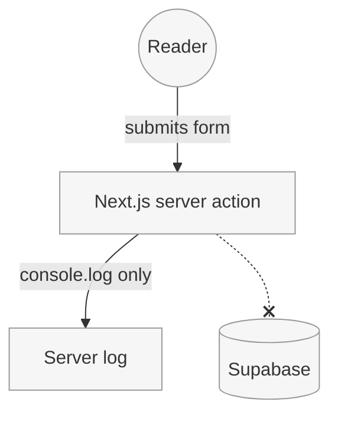

_Last updated: 2025-10-21 by gpt-5-codex_

# Data Flow (Comments and Contact)

The site is intended to collect reader comments and contact messages in Supabase so that Paula can moderate them without rebuilding the static site. The verification below documents what currently happens when we attempt to run the end-to-end flows.

## Verification log — 2025-10-21

### Comments

| Step | Endpoint / interface | Role or key | Observed behaviour |
| --- | --- | --- | --- |
| Submit | No comment form or API endpoint is implemented in the Next.js app (`rg "comment" src` returns no handlers). | N/A | Unable to submit; no network call is made to Supabase. |
| Approve | Supabase dashboard (expected). | Project owner (Paula) | Not exercised because no comment was created. |
| Read | Would require a read-only endpoint or Supabase anon key. | Public reader | Not exercised; there is nothing to fetch and no client code performs a request. |

### Contact

| Step | Endpoint / interface | Role or key | Observed behaviour |
| --- | --- | --- | --- |
| Submit | Next.js server action `src/app/contact/send.ts`. | Server runtime (no Supabase credentials loaded). | Form submission calls `sendMessage`, which only logs the payload (`console.log("[contact]", ...)`) instead of writing to Supabase. |
| Approve / Mark handled | Supabase dashboard (expected). | Project owner (Paula) | Not exercised because the submission never reaches Supabase. |
| Read | Would require a moderation UI or Supabase query. | Public reader / Paula | Not available; no data is persisted. |

### Environment findings

- `.env` is absent and `SUPABASE_URL` / `SUPABASE_SERVICE_ROLE_KEY` are not defined, so any server call to Supabase would fail even if implemented.
- No Supabase client or REST call is referenced in the application code; the contact flow currently ends at a console log.

## Next steps to achieve the intended Supabase flow

1. Implement authenticated server endpoints (e.g., `POST /api/comments`, `POST /api/contact`) that use the Supabase service role to insert rows with `approved = false` / `handled = false`.
2. Expose a read-only endpoint or client fetch that uses the anon key to retrieve approved comments by slug.
3. Provide operational guidance for Paula on using the Supabase dashboard to approve comments and mark contact messages as handled.
4. Populate deployment environments with the required Supabase credentials.
